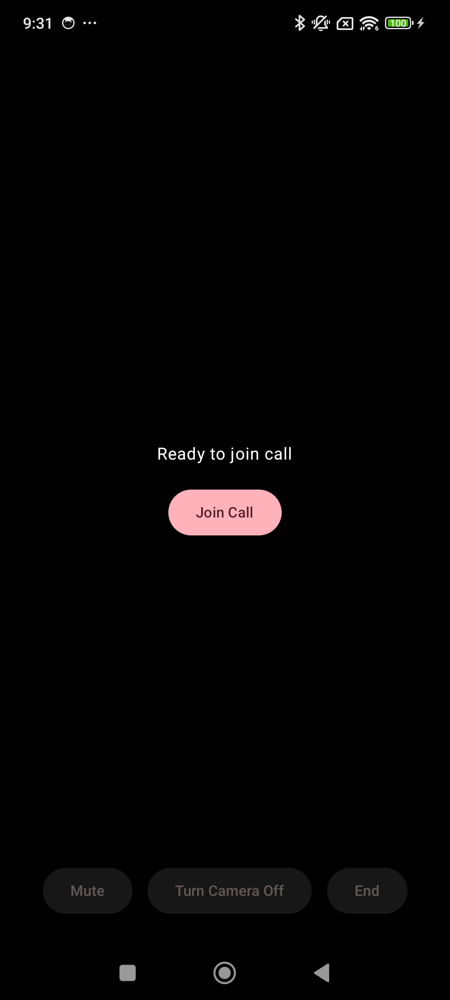
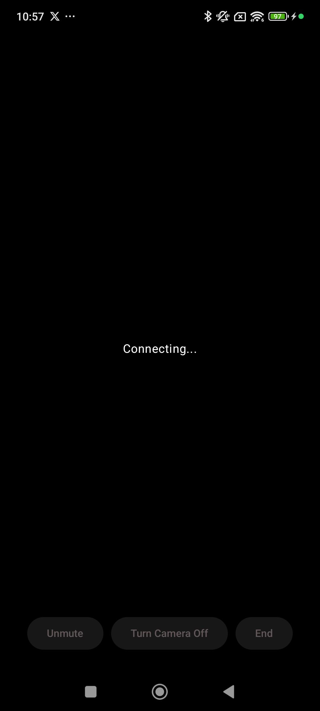
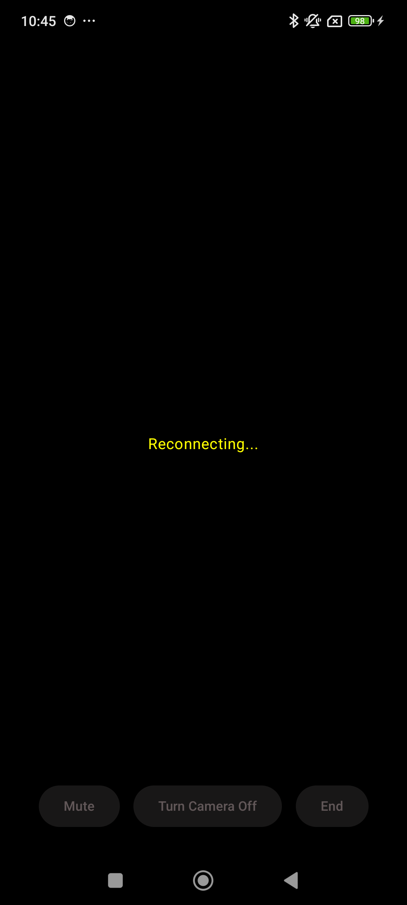
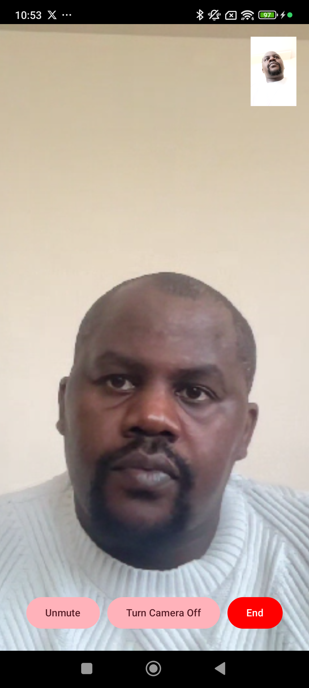
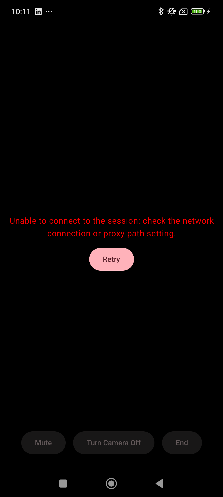

# 📹 Video Call App (Vonage + Jetpack Compose)

A simple video calling app built using **Vonage Video SDK (OpenTok)** and **Jetpack Compose**, demonstrating real-time communication, lifecycle handling, and state-driven UI.

---

## 📸 Screenshots

### 🟢 Idle (Ready to Join)
Initial state where the user can start a call.



---

### 🔄 Connecting
Displayed while establishing a session.



---

### 🔄 Reconnecting
Displayed while reestablishing a session.



---

### 📹 In Call
Active video call showing publisher and subscriber with controls.



---

### ⚠️ Error / Disconnected
Displays error state with retry option.



---

## ✨ Features

- 🎥 Real-time video calling using Vonage (OpenTok)
- 🎙 Toggle audio (mute/unmute)
- 📷 Toggle video (camera on/off)
- 🔁 Automatic reconnection handling
- ⚠️ Error handling with retry support
- 🔐 Runtime permission handling (Camera + Microphone)
- 📱 Lifecycle-aware session management
- 🧠 State-driven UI using ViewModel + StateFlow

---

## 🏗️ Architecture

The app follows a **unidirectional data flow**:

```
UI (Compose)
   ↓ events
ViewModel (state + business logic)
   ↓
Vonage Session (SDK)
   ↓
State updates → UI recomposition
```

---

## 📂 Project Structure

```
com.example.videoapp
│
├── config/
│   └── VideoConfig.kt   # Configuration setup
│
├── viewmodels/
│   └── VideoCallViewModel.kt   # Core logic + state management
│
├── ui/
│   ├── screens/
│   │   └── VideoCallScreen.kt  # Main video UI
│   ├── permissions/
│   │   └── VideoChatPermissionWrapper.kt
│   └── theme/
│
├── video/
│   └── ConnectionState.kt      # Connection state model
│
└── MainActivity.kt             # Entry point + lifecycle handling
```

---

## 🔄 Connection States

```kotlin
enum class ConnectionState {
    IDLE,          // Ready to join call
    CONNECTING,    // Establishing connection
    CONNECTED,     // Active call
    RECONNECTING,  // Recovering after interruption
    DISCONNECTED,  // Unexpected disconnect
    ERROR          // Failure state
}
```

---

## 🧠 Key Design Decisions

### 1. ViewModel as Single Source of Truth

* Holds session state, publisher, subscriber
* Handles lifecycle events (onResume, onPause, onDestroy)
* Exposes immutable UI state via StateFlow

### 2. Lifecycle-Aware Session Handling

* Avoids disconnecting during configuration changes
* Differentiates:
    * User-initiated disconnect
    * System/lifecycle interruptions

### 3. Compose + Native View Interop

* Uses AndroidView to render OpenTok video views
* Avoids remember {} for SDK views (prevents stale view issues)
* Safely removes parent view before reattaching

### 4. State-Driven UI

UI reacts to connection state:
* IDLE → Join call screen
* CONNECTING → Loading state
* CONNECTED → Video + controls
* RECONNECTING → Feedback to user
* DISCONNECTED / ERROR → Retry UI

### 5. Permissions Handling

* Uses Accompanist Permissions
* Displays fallback UI when permissions are not granted

---

## 🧪 Testing

Basic unit tests are included for VideoCallViewModel:

* Initial state validation
* Audio toggle behavior
* Video toggle behavior

Note: OpenTok SDK interactions are not unit tested due to native dependencies.

---

## 🚀 Getting Started

### 1. Clone the repository

```
git clone https://github.com/roysylvanus/VideoApp.git
```

### 2. Add Vonage credentials

Update the following credentials in VideoConfig.kt at the config directory:

```kotlin
VonageVideoConfig.APP_ID
VonageVideoConfig.SESSION_ID
VonageVideoConfig.TOKEN
```

### 3. Run the app

* Use a real device (recommended)
* Grant camera & microphone permissions

---

## ⚠️ Troubleshooting

If the call fails to connect or remains stuck in a loading state:
* Ensure your **Session ID** is correct
* Verify your **Token** is valid and not expired
* Check your network connection

## ⚠️ Known Limitations

* No backend (static session id/token used)
* Limited UI polish (focus on core functionality)
* Single session only (no multi-user management)

---

## 🔮 Future Improvements

* 🔐 Dynamic token generation via backend
* 👥 Multi-user support
* 🎨 Improved UI/UX (icons, animations)
* 📶 Network quality indicators
* 🔊 Audio routing (speaker/earpiece via Bluetooth)

---

## 💡 Learnings / Highlights

* Handling Compose + native SDK views
* Managing lifecycle vs user intent
* Designing robust connection state models
* Avoiding recomposition pitfalls with AndroidView

---

## 👤 Author

### Roy Sylvanus

---

## 📝 License

This project is for demonstration purposes.